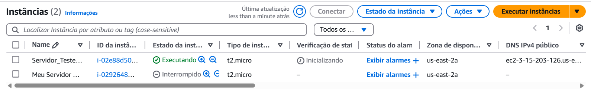
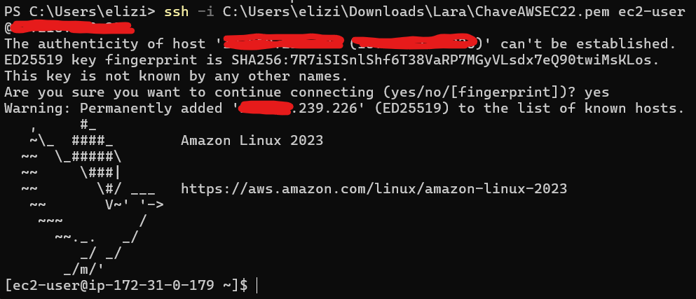
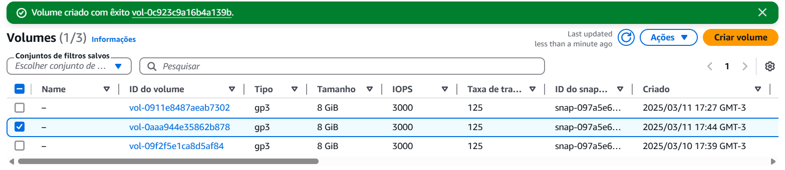
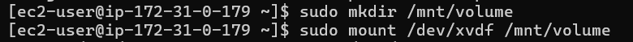
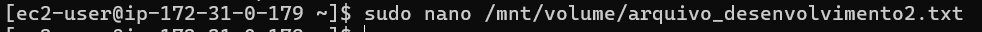
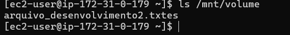
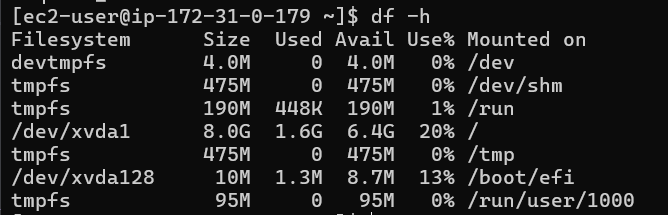

# 📍Desenvolvimento 2

## 📚 Instruções do projeto

A banda de Miguel te contratou para ajudá-los na criação de uma instância EC2 para organizar a documentação e os arquivos importantes da banda. Recentemente, a banda se interessou pelo mundo da computação em nuvem e decidiu explorar o Amazon EC2, um serviço popular de infraestrutura como serviço (IaaS) oferecido pela Amazon Web Services (AWS). Eles também conheceram o Amazon Linux, que é uma distribuição otimizada para a nuvem, sendo uma opção excelente para as instâncias EC2. Os membros da banda estão empolgados para testar essa tecnologia e começar a armazenar e gerenciar os seus documentos e arquivos na nuvem. Neste exercício, iremos ajudá-los com isso.

Exercício:

1. Configuração da instância EC2

   - acesse o Console da AWS e navegue até o serviço EC2;
   - crie uma nova instância EC2 usando a imagem Amazon Linux 2;
   - escolha o tipo de instância com base em suas necessidades de recursos.

2. Conexão via SSH

   - após a instância ser criada, use a chave privada para conectar via SSH;
   - execute os comandos necessários para acessar o terminal da instância.

3. Gerenciando o armazenamento

   - explore as opções de armazenamento oferecidas pelo Amazon EC2;
   - crie um novo volume Elastic Block Store (EBS) com um tamanho de sua escolha;
   - anexe o volume à sua instância EC2.

4. Formatando e montando o volume

   - formate o volume recém-criado usando um sistema de arquivos de sua escolha;
   - monte o volume em um diretório específico em sua instância.

5. Criação de arquivos

   - crie um arquivo de texto simples usando o editor de sua preferência;
   - salve esse arquivo no volume montado.

6. Explorando recursos:

   - use comandos, como ls, df -h, mount e cat, para verificar o status do volume montado, o espaço em disco disponível e o conteúdo do arquivo criado;
   - por fim, tire um print deste último passo e envie para avaliação.

Atenção: após executar o exercício, não se esqueça de interromper ou encerrar a instância criada para não gerar custos adicionais.

## 📝 Resolução

### **(1) Configuração da instância EC2**

A nova instância criada é Servidor_Teste_Web:

### **(2) Conexão via SSH**

### **(3) Gerenciamento e armazenamento**

Criação do volume:

### **(4) Formatando e montando o volume**

### **(5) Criação de arquivos**

### **(6) Explorando recursos**

ls /mnt/volume:

df -h:

